# 미래자리 MiraeSeat
  
> "미리 보는 내 자리" : 2020.03. ~ 2020.10. 캡스톤디자인 졸업작품

## 프로젝트 소개

### 프로젝트 개요
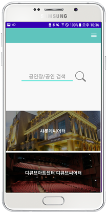

국내 공연장의 위치와 상연 중인 공연 정보, 좌석 배치도 정보를 제공하고, 각 좌석에 대해 후기 형식으로 정보를 공유할 수 있는 어플입니다. 공연 시장 소비자들의 현명한 소비 촉진을 목표로 하며, 여러 플랫폼에 흩어져 있는 정보를 집약적으로 관리 및 확인할 수 있게 합니다.

### 공식 로고

  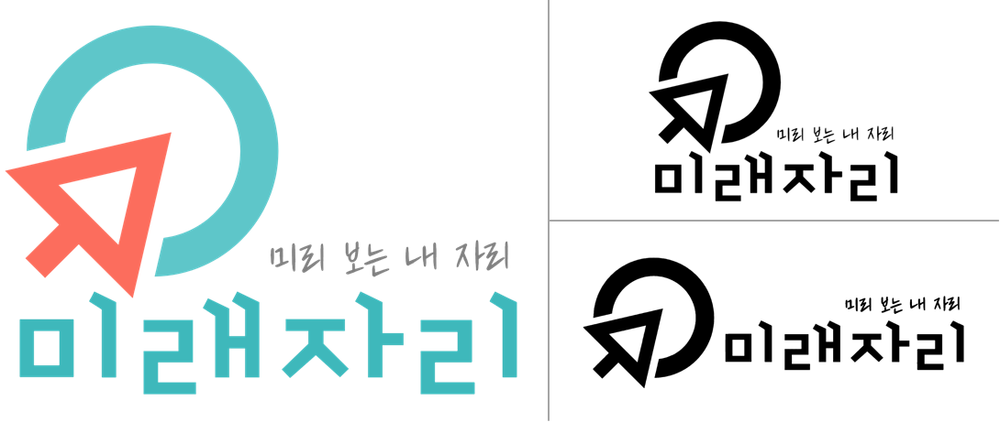

### 어플리케이션 흐름도

  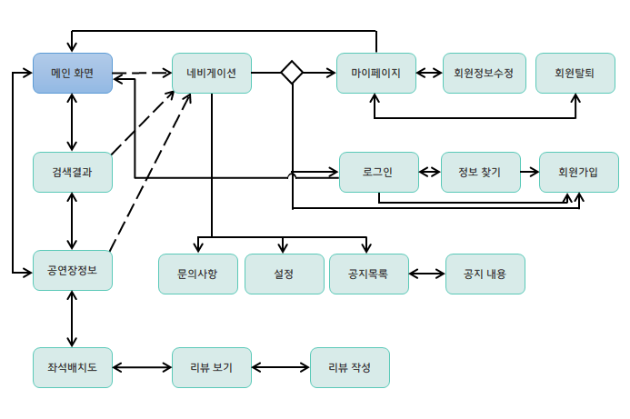

### 전체 시스템 구조

  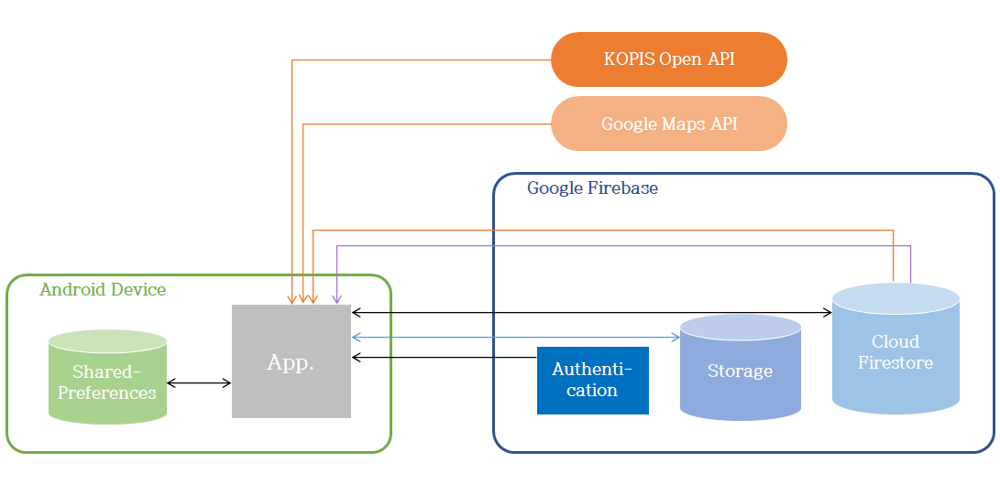

 

## 실행화면 및 사용 흐름

### 메인 화면
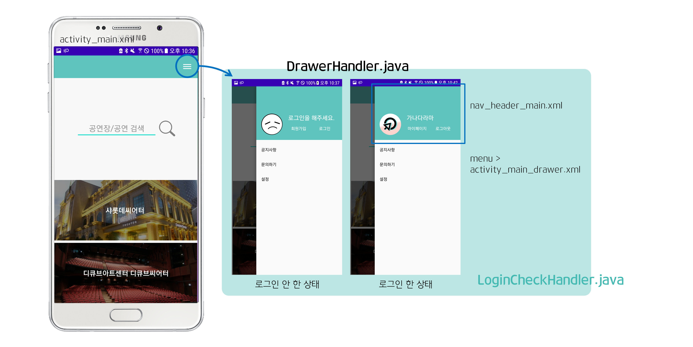
메인 화면에 구현된 기능은 크게 두 가지입니다.

- **검색 기능:** 공연시설명을 기준으로 공연장을 검색할 수 있다.

- **검색 TOP5 공연장 목록:** 사용자가 찾아본 공연장 TOP5를 역순으로 화면에 노출한다. 각 버튼을 누르면 해당하는 공연장의 상세 정보 페이지로 이동할 수 있다.

내비게이션 메뉴는 사용자 로그인 여부에 따라 상단 내용이 달라집니다. 로그인 시 닉네임과 프로필사진, 마이페이지 버튼, 로그아웃 버튼을 출력하며, 로그인하지 않은 경우 로그인을 해달라는 문구와 함께 회원가입, 로그인 버튼을 출력합니다. 이때 로그인 여부는 FirebaseAuth 객체를 이용해 확인합니다.

### 공연장 검색 및 정보 보기
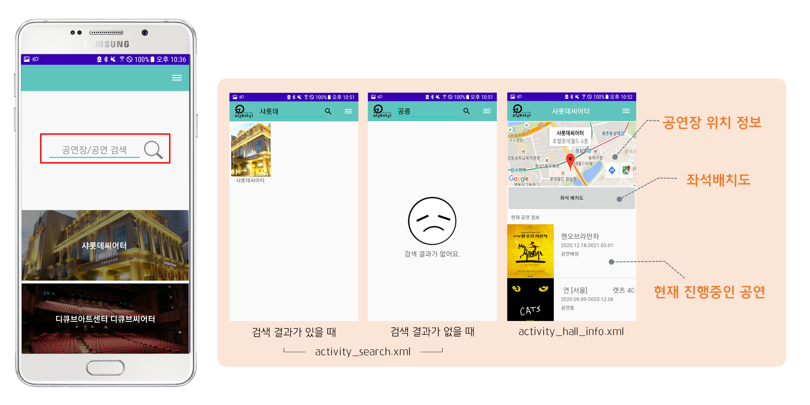
메인 화면의 검색창을 이용해 공연장을 검색할 수 있습니다. 이때 검색어는 공연시설의 이름을 기준으로 검색하며 공연장의 이름으로는 검색할 수 없습니다. (예: "충무아트센터 블랙"에서 "충무"로는 검색할 수 있지만 "블랙"으로는 검색 불가)

검색 결과는 3×n 형태로 나열되며, 결과가 한 건도 없으면 결과가 없다는 메시지만 출력됩니다.

검색 결과를 선택하면 해당 공연장의 상세 정보 페이지가 열립니다. 공연장의 위치가 구글 지도상에 표시되며, 현재 진행 중인 공연과 향후 진행 예정인 공연의 목록도 함께 확인할 수 있습니다. '좌석배치도' 버튼을 누르면 공연장의 좌석배치도와 각 좌석의 후기를 확인할 수 있는 페이지로 넘어갑니다.

### 좌석 후기 확인 및 작성
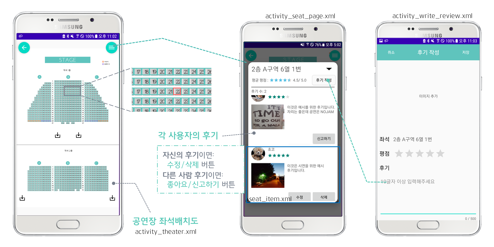
공연장 상세 정보 페이지에서 좌석배치도 버튼을 통해 해당 공연장의 좌석이 어떻게 배치되어 있는지 확인할 수 있으며, 좌석을 선택하고 화면 우측 상단의 버튼을 눌러 그 좌석의 후기를 볼 수 있습니다.

- **좌석배치도**: 터치로 확대/축소 가능. 좌석을 선택하면 Toast로 좌석 번호를 띄워준다.

- **후기 목록**: 현재 선택한 좌석의 번호, 평균 평점, 후기 개수와 함께 전체 후기를 볼 수 있다.

    - 목록의 후기는 작성 일자 최신순으로 정렬

    - 현재 로그인한 사용자가 작성한 후기이면 수정/삭제 버튼, 아니면 신고하기 버튼 노출

    - 상단의 '후기 작성' 버튼을 통해 해당 좌석의 후기 작성 가능

- **후기 작성**: 좌석의 후기를 작성할 수 있다. 평점과 10글자 이상의 내용을 필수로 작성해야 한다.

### 로그인 및 회원가입
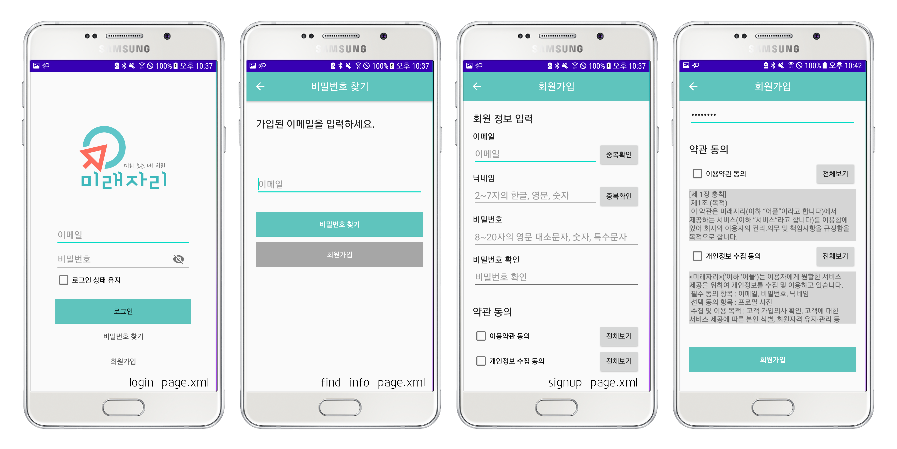
'미래자리'는 후기의 신빙성과 관리를 위하여 회원 제도로 운영됩니다. 로그인하지 않은 상태에서도 다른 사람이 작성한 후기를 확인할 수 있으나, 직접 후기를 작성하려면 반드시 로그인해야 합니다.

- **로그인**: 등록된 이메일과 비밀번호로 로그인할 수 있다.

    - 각 회원은 아이디 대신 이메일로 식별

- **비밀번호 찾기**: 회원이 비밀번호를 잊어버렸을 경우 일련의 과정을 거쳐 새로 설정할 수 있다.

    - 이메일을 입력하고 '비밀번호 찾기' 버튼을 누르면 비밀번호 재설정 안내 메일 발송

    - 회원이 메일의 링크를 누르면 비밀번호를 재설정할 수 있는 페이지로 연결

    - 재설정 페이지에서 비밀번호를 변경하고 나면 바뀐 비밀번호로 로그인할 수 있다.

    - _'미래자리'는 회원가입 시 별도의 개인정보를 수집하지 않고 본인확인 절차도 거치지 않으므로, 이메일을 분실한 경우에는 계정을 찾을 수 없다._

- **회원가입**: 이메일, 닉네임, 비밀번호를 입력하여 간편하게 가입할 수 있다.

    - 회원 식별과 다른 회원과의 혼란 방지를 위해 이메일과 닉네임은 유일값만 허용

### 마이페이지
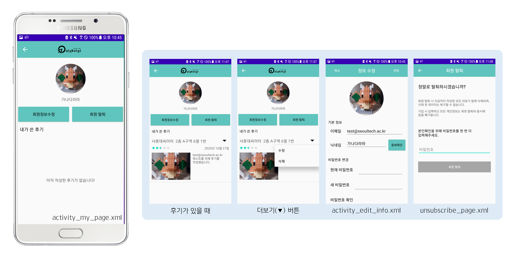
로그인을 완료한 회원은 내비게이션 메뉴를 통해 마이페이지를 볼 수 있습니다. 기본적으로 현재 등록된 프로필 사진과 닉네임을 확인할 수 있으며, 작성한 후기가 있으면 모든 후기를 모아 볼 수 있습니다.

- **내가 쓴 후기**: 지금까지 작성한 모든 후기가 최신순으로 정렬되어 보인다. 상단의 더보기(▼) 버튼을 눌러 각 후기를 수정하거나 삭제할 수 있다.

- **회원정보 수정**: 프로필 사진, 닉네임, 비밀번호를 바꿀 수 있다. 이메일은 변경 불가능하다.

- **회원 탈퇴**: 마이페이지의 '회원 탈퇴' 버튼을 거쳐 탈퇴할 수 있다.

    - 실수로 누르거나 타인의 부적절한 접근을 차단하기 위해 비밀번호를 한 번 더 입력받는다.

    - 탈퇴할 경우 지금까지 작성한 모든 후기가 자동으로 삭제되며, 이는 복구 받을 수 없다.

### 설정 페이지
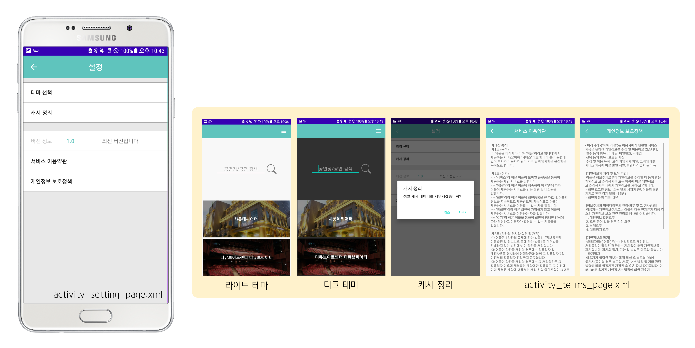
사용자의 편리에 맞춘 애플리케이션 사용을 위해 설정 페이지를 추가하여 테마 선택과 캐시 정리, 버전 정보 확인, 회원가입 시 동의한 약관 확인 기능을 구현하였습니다.

- **테마 선택**: light, dark, default의 세 가지 선택지가 있다. 이 중 default는 디바이스 설정에 따른다.

- _버전 정보는 실제 어플리케이션 버전이 표기되지만, 최신 정보 확인 기능은 미구현 상태._
 

## 구현 세부 내용

### 검색 기능
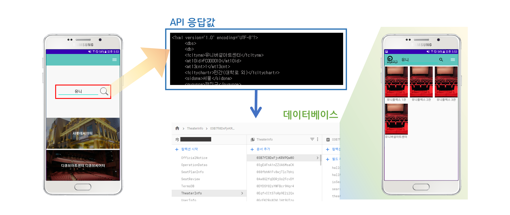
검색 기능은 다음과 같은 과정을 거쳐 작동합니다.

1. 사용자가 검색어를 입력하면 이를 KOPIS API로 요청하여 결과에 해당하는 목록을 받아온다.  
    → 검색되는 각 공연시설의 이름과 ID(외 나머지 몇 가지 정보)를 반환받는다.
    
2. API가 반환해 준 메시지에서 각 공연시설의 ID만 따로 추출하여 배열에 담아둔다.
    
3. 2에서 얻은 각 공연시설 ID를 Firebase의 자체 데이터베이스에서 검색한다.  
    → 검색 결과로 각 공연시설이 가진 공연장과 그 공연장의 ID를 얻어온다.
    
4. 각 공연시설의 이름과 시설에 속한 공연장 이름을 합성하여 최종 결과를 출력한다.
    또한 내부적으로는 추후 사용될 상황을 대비하여 공연시설과 ID와 공연장 ID도 미리 합성해둔다.

검색 시 API와 자체 데이터베이스를 각각 거치는 것은 KOPIS API와 관련된 문제로, 요약하자면 KOPIS에서는 공연시설에 속한 공연장의 목록을 반환해주는 기능이 없었기 때문입니다. 미래자리 어플리케이션에서 실제 중요한 정보는 공연장 각각이기 때문에 이를 보완하기 위하여 추가 데이터베이스를 사용하고 있습니다.

### 좌석배치도
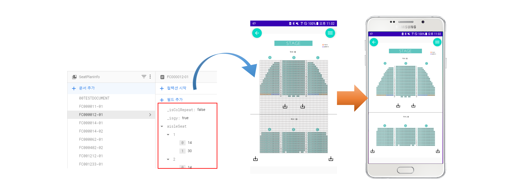
좌석배치도의 좌석 버튼은 테이블 레이아웃을 이용해 구현하였습니다. 데이터베이스에서 공연장별로 저장된 수치를 읽어오고, 마진과 비율을 적절히 조정한 뒤, 배치도의 좌석 위로 레이아웃을 올려 좌석을 표현합니다.

1. 공연시설-공연장 결합 ID를 이용, 데이터베이스에서 필요한 정보를 얻어온다.  
    → 좌석배치도 이미지 저장 위치(Storage 링크), 마진, 비율, 좌석 수 등
    
2. 받아온 정보를 사용하여 좌석배치도에 알맞은 레이아웃을 구현한다.
    1. 좌우 여백 정보와 좌석 크기 정보를 이용해 이미지 위에 테이블 레이아웃을 띄운다.
    2. 복도 위치, 층 사이 여백 등의 값에 맞게 버튼을 띄우고 버튼 태그에 좌석 이름을 설정한다.  
        → 버튼에 설정된 태그는 이후 좌석별 후기를 확인하기 위한 키로 사용

좌석배치도는 사용자의 편의성을 고려하여 확대할 수 있게 되어있습니다. 이때 각 상황에서 원치 않는 클릭 이벤트를 방지하기 위하여 배치도 확대 시에는 드래그 기능만, 좌석 선택 시에는 버튼 클릭 기능만 작동하도록 구현하였습니다.

### 어플리케이션 테마
라이트 테마와 다크 테마를 각기 따로 설정하기 위해 우선 `AppTheme`을 `Theme.AppCompat.DayNight`로 맞춰주었습니다. 각 버전에 따른 색상을 지정하기 위해 두 개의 colors 파일을 사용합니다. values 폴더 아래의 colors.xml에는 라이트 테마에서 사용할 색이, values-night 폴더 아래의 colors.xml에는 다크 테마에서 사용할 색이 기록되어 있습니다.

이후 사용자의 선택에 따라 NIGHT MODE를 켜거나 끔으로써 각 모드를 구현하였습니다.

- 라이트 테마: NIGHT MODE를 기본적으로 사용하지 않게 함으로써 라이트 테마를 유지  
  `AppCompatDelegate.setDefaultNightMode(AppCompatDelegate.MODE_NIGHT_NO);`
    
- 다크 테마: NIGHT MODE를 강제로 사용하게 하여 다크 테마를 활성화  
  `AppCompatDelegate.setDefaultNightMode(AppCompatDelegate.MODE_NIGHT_YES);`
    
- Default 테마: 디폴트 테마는 안드로이드 버전에 따라 다르게 작동하는데, 안드로이드 10 이상일 경우 디바이스 설정에 따라 자동으로 바뀌며 9 이하 버전의 기기에서는 절전 모드 시 다크 테마로 전환되게 설정한다.  
  `AppCompatDelegate.setDefaultNightMode(AppCompatDelegate.MODE_NIGHT_FOLLOW_SYSTEM);`  
  `AppCompatDelegate.setDefaultNightMode(AppCompatDelegate.MODE_NIGHT_AUTO_BATTERY);`

선택한 테마는 SharedPreferences에 저장하여 애플리케이션 종료 및 재기동 시에도 유지됩니다.
 
 

## 팀 정보
#### 오나현 [Github](https://github.com/onhyeon618)
#### 장혜진 [Github](https://github.com/jhj5897)
#### 이명주 [Github](https://github.com/mmmmjjj)
 
